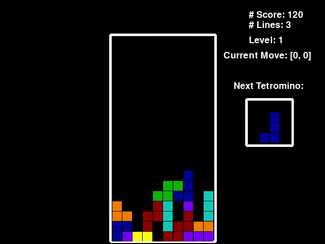
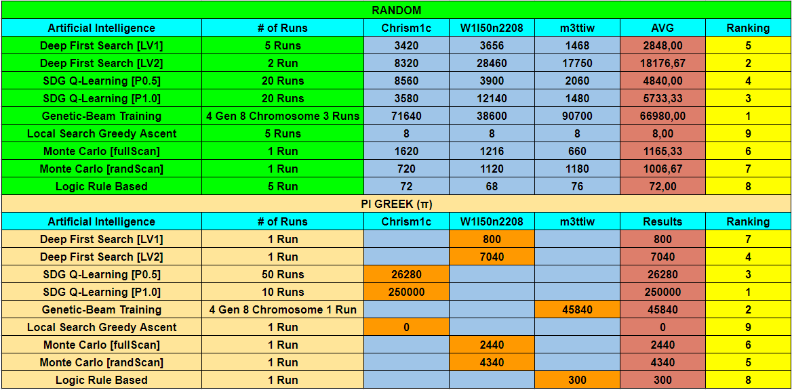
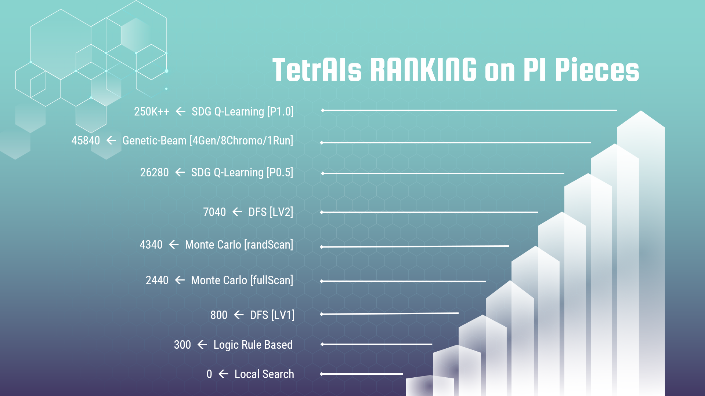
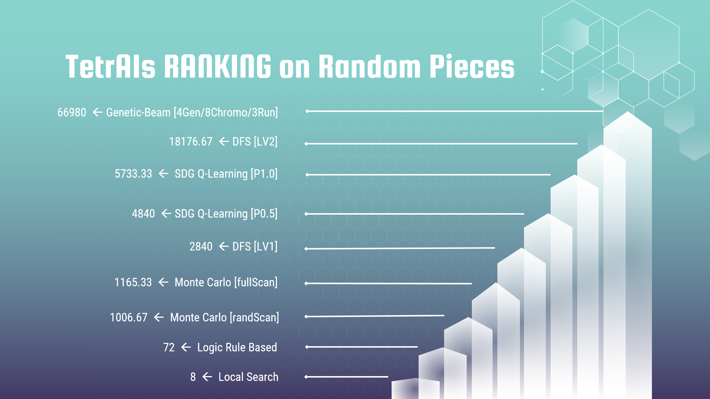

# TetrAIs
### Six Tetris Artificial Intelligence Algorithms Showdown<br>
<p align="center">
  
</p>

### Index

1. [**What is TetrAIs?**](#what-is-tetrais)
2. [**System Dependencies**](#requirements-and-dependencies)
3. [**Quick Start**](#quick-start)
4. [**Artificial Intelligences Explained**](#artificial-intelligences-explained)
5. [**Evaluation and Results**](#evaluation-and-results)
6. [**Conclusions**](#conclusions)
7. [**Credits**](#credits)

<ul>


## What is TetrAIs?

**TetrAIs** is an application developed for a knowledge engineering exam 
at **Univeristy Aldo Moro** of Bari Italy. <br>
its goal is to show the differences, the advantages and disadvantages of using 
different artificial intelligence algorithms that are able to learn optimizing itself
like **"Q-learning"**, or based on randomness like **"Blind Bandit Monte Carlo"** and **"Genetic-Beam"**, 
based on a KB and logical rules like **"Logic Rule Based"**, or finally based 
on the complete visit of the research space as **"Deep First Search"** does .

### Extra Functionalities
<ul>

<li>
    Guide Side Panel : Useful to learn an introduction of AIs Theory while playing
</li>
<li>
    Decisional Tree Plot : Useful to see all possible choose of DFS LV1, DFS L2 or MCTS (Deep < 3)
</li>
<li>
    Result Plot : Useful to show how learn Gentic-Beam AI or SDG_QL AI
</li>
<li>
    Real Time Console Prints : Useful to see what the AI is doing
</li>
<li>
    Logger : Useful to save console output on file (not activable from GUI)
</li>

</ul>


<li>

## Requirements and Dependencies
```
Python 3.4 or higher (tested on 3.7)
networkx
numpy==1.18.1
mpmath==1.1.0
pygame==1.9.3
pygame-menu==2.1.2
matplotlib==2.1.2
pyautogui==0.9.36
 ```  
	
**Resources for dependencies required** <br>
Pygame: [**github.com/pygame/pygame**](https://github.com/pygame/pygame) <br>
Pygame-menu: [**github.com/ppizarror/pygame-menu**](https://github.com/ppizarror/pygame-menu) <br>
Pyswip: [**github.com/yuce/pyswip**](https://github.com/yuce/pyswip) <br>
Networkx: [**github.com/networkx/networkx**](https://github.com/networkx/networkx) <br>
Numpy: [**github.com/numpy/numpy**](https://github.com/numpy/numpy) <br>
Mpmath: [**github.com/fredrik-johansson/mpmath**](https://github.com/fredrik-johansson/mpmath) <br>
Matplotlib: [**github.com/matplotlib/matplotlib**](https://github.com/matplotlib/matplotlib) <br>
Pyautogui: [**github.com/asweigart/pyautogui**](https://github.com/asweigart/pyautogui) <br>

</li>
<li>

## Quick Start

1 - Clone this repository <br> 
2 - Install all dependencies (N.B.: Rule Based needs SWI-Prolog installed) <br> 
3 - Execute "main.py" <br>
4 - Enjoy with **TetrAIs** <br>

</li>
<li>

## Artificial intelligences Explained
Full documentation inside "/doc/Documentazione TetrAIs.pdf" <br>
Full presentation inside "/doc/Presentazione TetrAIs.pptx" <br>
___

#### 1) Deep First Search (DFS) <br>
A generic search algorithm is independent of any search strategy. The idea is that given a graph, the paths are incrementally explored starting from the starting nodes and then reaching the target nodes.

DFS is an uninformed search algorithm on graphs, in which the system reasons on a model of the world made of states, in the absence of uncertainty and with purposes to be achieved:
- A flat representation of the domain,
- In the state space, a way is sought to go from the current state to a goal.

In in-depth research (DFS), the border is organized as a stack (LIFO) in which the elements are added one at a time and the one selected and taken will be the last added.
___

#### 2) Stochastic Gradient Descent with Q-Learning (SDG_QL) <br>
The SDG_QL algorithm is based on the Stochastic Gradient Ascent algorithm as an optimization of Q-Learning
It uses a "weights vector" representing the importance that each metric has within the score calculation function. 
It choose the best move to play given a game scheme (State), the algorithm compares the possible moves (Action) concerning only the current tetramino simulating a "drop ” of the tetramino on the board.

The AI ​​calculates the Reward relating to the Action on the current State. 
<br> The **Reward = 5 * (linesRemvd * lineRemvd) - (Hsum - oldHsum)**

The TD-Update rule of the Q-learning algorithm returns the "Q-value" as well as the new weight in the vector :
<br> **wx [i] = wx [i] + alpha * wx [i] * (Reward - oldPar[i] + gamma * newPar[i])**

The policy is ε probability of extracting the not highest Q-value move. 

The proposed AI update its weights and converge towards values ​​sufficient to obtain very high scores in relatively few “training runs”.
___

#### 3) Genetic-Beam (Gen) <br>
Mashup:
- Reproductive trait of Genetic
- Efficiency of Beam Search

Each gene represents the weight of one of the heuristics used by the system.

New generation composed of: <br>
- ½ better chromosomes of the previous generation
- ½ one point crossing between the best chromosomes of the previous generation

In the crossing phase we select two of the best chromosomes and we couple them. For each chromosome gene that is the child of two parent chromosomes:
- 20% chance that the gene is from one of the two parents
- 80% chance that the gene is an average of the two parents' respective genes

At this stage there is also a 10% chance of a slight gene mutation.
___

#### 4) Blind Bandit Monte Carlo Tree Search (BBMCTS) <br>
MCTS (Monte Carlo Tree Search) is a heuristic search strategy adopted in some types of decision-making processes, such as those decision-making processes that are typically adopted in games.
Markov Chain Monte Carlo (MCMC) methods are applied to generate samples.

The goal of the MCTS is to analyze the most promising playouts, expanding the search tree, which is based on a random sampling of the search space. The final result of each playout is used to weigh the nodes of the search tree, so that the best nodes subsequently have more chances to be chosen for future playouts.

Each round of the choice of move in the MCTS consists of four steps:
- Selection
- Expansion
- Simulation
- Backpropagation
___

#### 5) Logic Rule Based (RB) <br>
For "Rule Based" Agent, we mean an Ai who uses a knowledge base to find the best move with a tetromino, in an instance of the board.

Coding all the possibilities present in the sheet, as well as being expensive, made it an unintelligent agent, since when it talks about AI it is only necessary to describe the solution to the problem, not how to reach it.

So we took into consideration the "shadows" of the tetramines: each tetromino, in every rotation, casts a different shadow on the crest of the card
___

#### 6) Local Search Greedy Ascent <br>
The Local Search AI scans the first level of the tree search, selecting the node representing the move that during the simulation would have returned the highest score obtaining an excellent local state. Subsequently, the algorithm searches for the next state using the "next tetramino" in the node-states obtained from the previous state. In this way, the algorithm significantly reduces the number of total simulations and therefore reaches an excellent room.

Since Local Search does not guarantee the achievement of an excellent overall and its use is often used in situations where the individual paths are very long, in our use it proves to be particularly inefficient and not very productive. 
Often the executions of the game that use it, end with a score of zero, this occurs because the paths of the graph are very short and the excellent location achieved does not guarantee the permanence in the game and the achievement of results even only comparable with those of the other algorithms implemented.
___

</li>

<li>

## Evaluation and Results

#### TetrAIs group results


#### TetrAIs AIs ranking on "PI greek" pieces


#### TetrAIs AIs ranking on "random" pieces


</li>

<li>

## Conclusions

</li>

**With this experiment we want to highlight that:**
- Not all approaches regarding artificial intelligence perform in any application domain;
- The SDG Q-Learning technique and population-based research methods (Genetic Beam-Search) are considerably better performing than the others given their nature of "past experience learning" at the expense of a considerably higher training time;
<br>

**- Analysis of Genetic - Beam training:**
The algorithm performance are directly proportional to the number of generations with a high number of chromosomes eatch. But consequently considerably increases the necessary training time.
<br>

**- Analysis of SDG Q-Learning training:**
The algorithm performs considerably better when the algorithm learns on a deterministic path and labyrinth rather than on a random path, that is, different for each iteration.
<br>

**Analysis of the Blind Bandit Monte Carlo:**
The algorithm would prove much more efficient in other domains where moves can be demoted in the event of an error, while in the Tetris a wrong move causes a domino effect which in most cases leads to a rapid conclusion. In our case, he remains "attracted" to imaginary moves that are difficult to materialize.
<br>

**- Deep First Search analysis:**
Statistically it appears to be balanced both from the temporal point of view and from the results achieved. It could be improved with deeper analyzes, for example by implementing the height of the search tree, keeping an eye on performance.
<br>

**- Analysis of Local Search Greedy Ascent:**
Given the poor results, the algorithm could be improved by integrating alternative methods such as the "random restart" for the scan of the search tree in order to reach the global optimum rather than the local optimum.
<br>

**- Logic Rule Based Analysis:**
In order to improve the performance of this algorithm, it would be useful to consider clauses and rules of different nature, to evaluate more aspects of the pitch, rather than evaluate the next move based only on the shadow of the tetramini. Doing so would extend the unkempt knowledge from the knowledge base.


<li>
	
### Credits

**Developed and Designed by:**

[**Chrism1c**](https://github.com/Chrism1c)**,**
[**m3ttiw**](https://github.com/m3ttiw) **and**
[**W1l50n2208**](https://github.com/W1l50n2208)

**TetrAIs group scores:**
- **Chrism1c :**
- **m3ttiw :** 5740
- **W1l50n2208 :**

**_Are you able to beat us ?_**

</li>
</ul>
